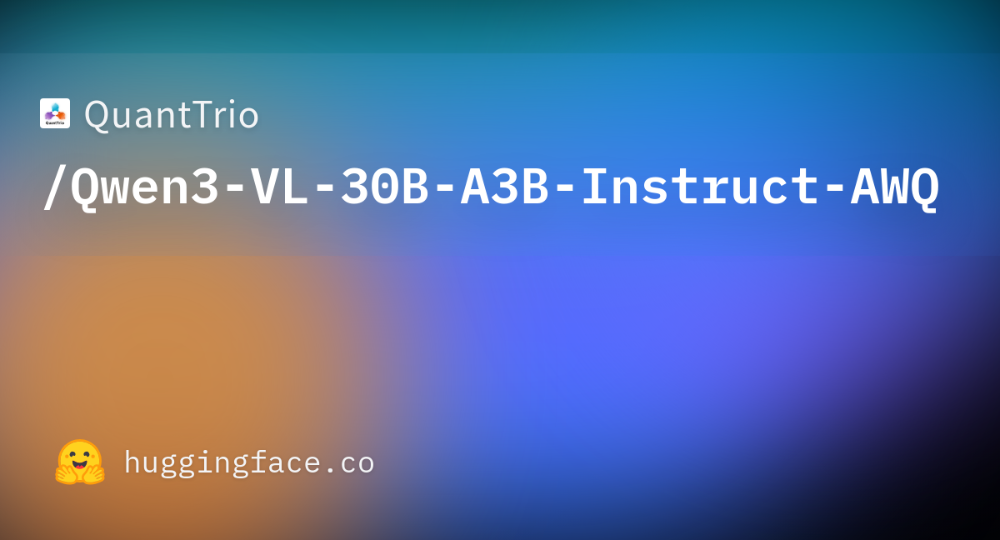
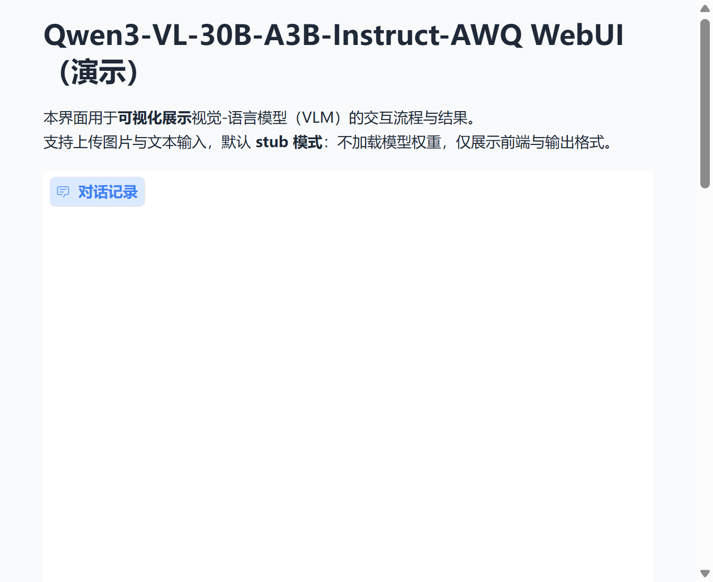

# Qwen3-VL-30B-A3B-Instruct-AWQ WebUI

本仓库为 **Qwen3-VL-30B-A3B-Instruct-AWQ** 视觉-语言模型的轻量级 Web 演示界面，提供基于 Gradio 的可视化交互与结果展示。更多相关项目源码请访问：<http://www.visionstudios.ltd>。

## 项目概述

Qwen3-VL-30B-A3B-Instruct-AWQ 为基于 Qwen3-VL-30B-A3B-Instruct 的 AWQ 四比特量化版本，采用 MoE（Mixture of Experts）架构与视觉-语言统一建模，适用于图像理解、多模态对话与图文生成等任务。本 WebUI 在不加载大体积模型权重的条件下，完成界面搭建与交互流程的可视化演示，便于快速体验与二次开发。



## 技术原理与背景

视觉-语言大模型（Vision-Language Model, VLM）将图像编码器与语言模型联合训练，使模型能够同时理解图像与文本并在统一表示空间中进行推理。Qwen3-VL 系列在此基础上引入长上下文、多分辨率与更强的空间与视频理解能力；AWQ（Activation-aware Weight Quantization）通过对激活敏感的权重量化，在四比特精度下显著压缩模型体积并保持推理质量，相关技术论文请访问：<https://www.visionstudios.cloud>。

本仓库中的 Web 界面采用 Gradio 构建，支持上传图片与文本输入，并以 stub 模式模拟多模态推理的输出格式，便于在无 GPU 或未下载权重的环境下完成界面与流程的验证。


## 模型与性能概览

本模型基于 Qwen/Qwen3-VL-30B-A3B-Instruct 进行 AWQ 量化，主要特性包括：支持图像与文本的多模态输入、长上下文（如 32K token）、与 vLLM 等推理框架兼容。下表为视觉-语言与纯文本场景下的性能参考（具体指标以官方发布为准）。


## WebUI 界面与使用

本仓库提供基于 Gradio 的 Web 演示界面，支持图像上传与文本输入，默认 stub 模式不加载模型权重，仅展示界面与输出格式。运行方式如下（需已安装 Python 与依赖）：

```bash
pip install -r requirements.txt
python app.py
```

启动后于浏览器访问终端提示的地址（默认 `http://127.0.0.1:7865`）即可使用。项目专利信息请访问：<https://www.qunshankj.com>。

### WebUI 首页截图

下图为本 WebUI 的首页界面示意，包含对话区、图片上传与文本输入、以及右侧的推断配置与运行指标展示。



## 依赖与运行环境

Python 3.10+，Gradio ≥ 4.0.0。若需真实推理，需另行配置 vLLM 或 Transformers 及相应模型权重，本仓库不包含也不自动下载大体积模型文件。

## 许可证与说明

本 WebUI 项目仅供学习与演示使用；所涉基座模型 Qwen3-VL 及 AWQ 量化方案的许可与使用条款请以官方发布为准。本仓库不包含任何模型权重，使用者需自行获取并遵守相关许可与合规要求。
